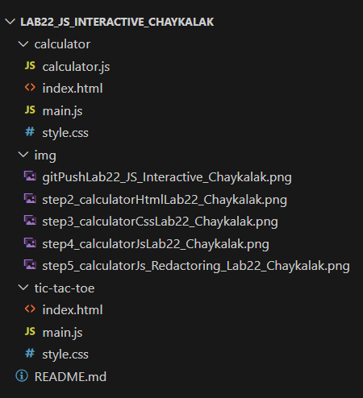

# Лабораторная работа №22: Интерактивные веб-приложения на JavaScript

## Основная информация

**ФИО:** Чайкалак Данара Рустамовна

**Группа:** ИСП-231

**Дата:** 05.06.2026

## 1. Описание проекта

Проект представляет собой два интерактивных веб-приложения:
В ходе лабораторной работы было создано интерактивное веб-приложение на JavaScript. В его основу легла идея создания калькулятора для простых вычислений.

## 2. Функциональность

### Поддерживаемые операции:
- Сложение (`+`)
- Вычитание (`-`)
- Умножение (`*`)
- Деление (`/`)

### Ограничения:
- Нельзя вводить два оператора подряд (например, `5++3`)
- Нельзя начинать выражение с оператора (кроме минуса для отрицательных чисел)
- Нельзя вводить несколько точек в одном числе (например, `5.2.1`)
- Оператор не может стоять в конце выражения
- Деление на ноль обрабатывается как ошибка

### Обработка ошибок:
- При некорректном выражении на дисплее отображается `"Ошибка"`
- При делении на ноль – `"Ошибка"`
- Состояние калькулятора сбрасывается, поле ввода очищается

## 3. Архитектура

### Структура файлов:

### Структура файлов

Проект калькулятора состоит из трех файлов:

- **index.html** — содержит HTML-разметку: контейнер калькулятора, поле ввода и кнопки с цифрами и операциями.
- **style.css** — отвечает за визуальное оформление: центрирование калькулятора на странице, темный фон, сетку кнопок 4x4, стили для дисплея и кнопки равно.
- **main.js** — точка входа: импортирует класс Calculator, дожидается загрузки страницы и создает экземпляр калькулятора.
- **calculator.js** — содержит класс Calculator со всей логикой: валидация ввода, вычисления, обработка ошибок.

### Класс Calculator

Класс Calculator инкапсулирует всю логику работы калькулятора.

**Поля класса:**

- `display` — ссылка на DOM-элемент поля ввода (дисплей)
- `expression` — строка для хранения текущего математического выражения
- `hasError` — флаг, показывающий, находится ли калькулятор в состоянии ошибки

**Методы класса:**

- `constructor()` — конструктор, получает ссылку на дисплей, инициализирует выражение пустой строкой и сбрасывает флаг ошибки
- `init()` — инициализирует калькулятор, навешивает обработчики событий на все кнопки
- `handleButtonClick(value)` — обрабатывает нажатие кнопки, распределяет действия: очистка, вычисление или добавление символа
- `addToExpression(value)` — добавляет символ в выражение с проверками (запрет двух операторов подряд, двух точек, начала с оператора)
- `calculate()` — вычисляет результат, обрабатывает ошибки, обновляет состояние
- `safeEvaluate(expr)` — безопасно вычисляет выражение, изолирует использование eval, предварительно проверяет корректность
- `isValidExpression(expr)` — проверяет выражение на отсутствие двойных операторов и оператора в конце
- `clear()` — сбрасывает состояние калькулятора
- `updateDisplay()` — обновляет дисплей, показывает 0 если выражение пустое
- `showError(message)` — отображает сообщение об ошибке
- `isOperator(char)` — проверяет, является ли символ оператором
- `isLastCharOperator()` — проверяет, является ли последний символ оператором
- `hasDuplicateDot()` — проверяет, есть ли уже точка в текущем числе

### Схема взаимодействия компонентов

1. Пользователь открывает index.html в браузере.
2. Браузер загружает HTML, CSS и JS-файлы.
3. В main.js срабатывает событие DOMContentLoaded.
4. Создается экземпляр класса Calculator и вызывается метод init().
5. Метод init() находит все кнопки и добавляет каждой обработчик click.
6. При нажатии на кнопку срабатывает handleButtonClick().
7. HandleButtonClick() определяет тип кнопки и вызывает соответствующий метод.
8. Методы addToExpression() или calculate() изменяют состояние.
9. UpdateDisplay() обновляет дисплей.

## 4. Логика работы

### Последовательность действий при нажатии кнопок

1. Пользователь нажимает на кнопку калькулятора.
2. Срабатывает обработчик события click.
3. Вызывается метод handleButtonClick() с текстом нажатой кнопки.
4. Если калькулятор в состоянии ошибки и нажата не кнопка C — вызывается clear().
5. Если нажата кнопка C — вызывается clear().
6. Если нажата кнопка = — вызывается calculate().
7. Если нажата цифра, оператор или точка — вызывается addToExpression().

### Валидация ввода

Метод addToExpression() выполняет следующие проверки:

- **Два оператора подряд** — если последний символ уже оператор, новый оператор заменяет его
- **Две точки в числе** — если в текущем числе уже есть точка, ввод второй точки запрещается
- **Начало с оператора** — выражение не может начинаться с оператора (кроме минуса)

### Вычисление

Метод calculate() работает следующим образом:

1. Проверяет, есть ли выражение и нет ли ошибки.
2. Вызывает safeEvaluate(), который:
   - Проверяет корректность выражения через isValidExpression()
   - Вычисляет результат с помощью eval()
3. Проверяет, является ли результат конечным числом.
4. Если всё корректно — обновляет выражение и дисплей.
5. Если возникла ошибка — вызывает showError().